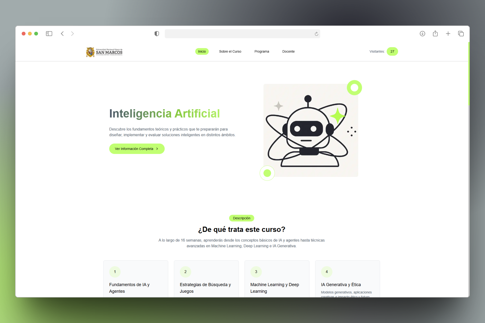

# UNMSM IA 2025 - Landing Page



> **Inspiración:**
> Este proyecto está inspirado en el diseño de [Positivus Landing Page en Figma](https://www.figma.com/design/pozuIu9WGAHeY1xb9AuMsa/Positivus-Landing-Page-Design--Community-?node-id=423-1034&t=bmvKfXs4GYniefz3-0). Puedes ver el arte base en [`/public/figma.svg`](./public/figma.svg).

## 🌐 Vista previa

[https://unmsm-ia-2025-landing.vercel.app/](https://unmsm-ia-2025-landing.vercel.app/)

---

## 📋 Descripción

Landing page para el curso de **Inteligencia Artificial** de la Universidad Nacional Mayor de San Marcos (UNMSM). Presenta información del curso, cronograma, docente, grupos de trabajo y recursos clave, con un diseño moderno y adaptable.

## 🛠️ Herramientas y Tecnologías

- **Next.js 15** (React 19)
- **TypeScript**
- **Tailwind CSS 4**
- **Lucide React** (iconos)
- **Upstash Redis** (contador de visitas)
- **Vercel** (deploy)
- **Figma** (diseño base)
- **Bun** (gestor de paquetes)

## 📁 Estructura del Proyecto

```
├── public/
│   ├── figma.svg
│   ├── mockup.png
│   └── ...
├── src/
│   ├── app/
│   ├── components/
│   ├── data/
│   └── sections/
├── package.json
├── tailwind.config.js
├── postcss.config.mjs
├── tsconfig.json
└── ...
```

## 🚀 Instalación y Uso

1. Clona el repositorio:
   ```bash
   git clone https://github.com/S4vi0r17/UNMSM-IA2025-Landing
   cd UNMSM-IA2025-Landing
   ```
2. Instala dependencias:
   ```bash
   bun install
   # o
   npm install
   ```
3. Crea un archivo `.env` basado en `.env.example` y agrega tus credenciales de Upstash Redis:
   ```env
   UPSTASH_REDIS_REST_URL=
   UPSTASH_REDIS_REST_TOKEN=
   ```
   > Estas credenciales se obtienen al crear un proyecto en Upstash Redis.
4. Inicia el servidor de desarrollo:
   ```bash
   bun run dev
   # o
   npm run dev
   ```
5. Abre [http://localhost:3000](http://localhost:3000) en tu navegador.

## 📦 Scripts útiles

- `bun run dev` / `npm run dev` — Desarrollo
- `bun run build` / `npm run build` — Build de producción
- `bun run start` / `npm run start` — Servidor de producción
- `bun run lint` / `npm run lint` — Linter

## 👨‍🎓 Créditos

- **Docente:** Luis Angel Guerra Grados ([lguerrag1@unmsm.edu.pe](mailto:lguerrag1@unmsm.edu.pe))
- **Desarrollo:** Eder Gustavo Benites Pardave
- **Diseño base:** [Figma - Positivus Landing Page](https://www.figma.com/design/pozuIu9WGAHeY1xb9AuMsa/Positivus-Landing-Page-Design--Community-?node-id=423-1034&t=bmvKfXs4GYniefz3-0)

## 🖼️ Imágenes y Recursos

- [`/public/figma.svg`](./public/figma.svg): Arte base Figma
- [`/public/mockup.png`](./public/mockup.png): Mockup de la landing
- [`/public/hero.png`](./public/hero.png): Imagen principal

---

¡Sugerencias y mejoras son bienvenidas 🦎!
